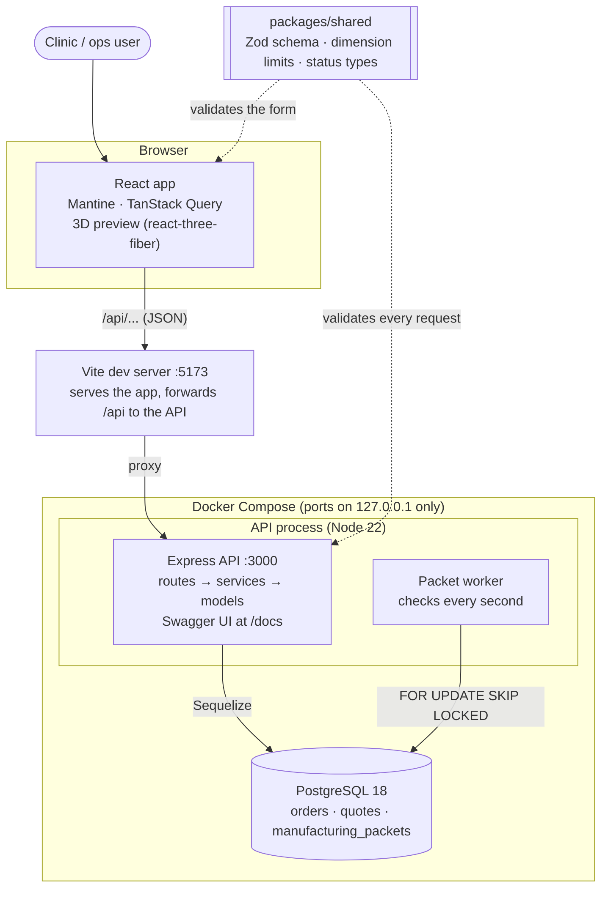
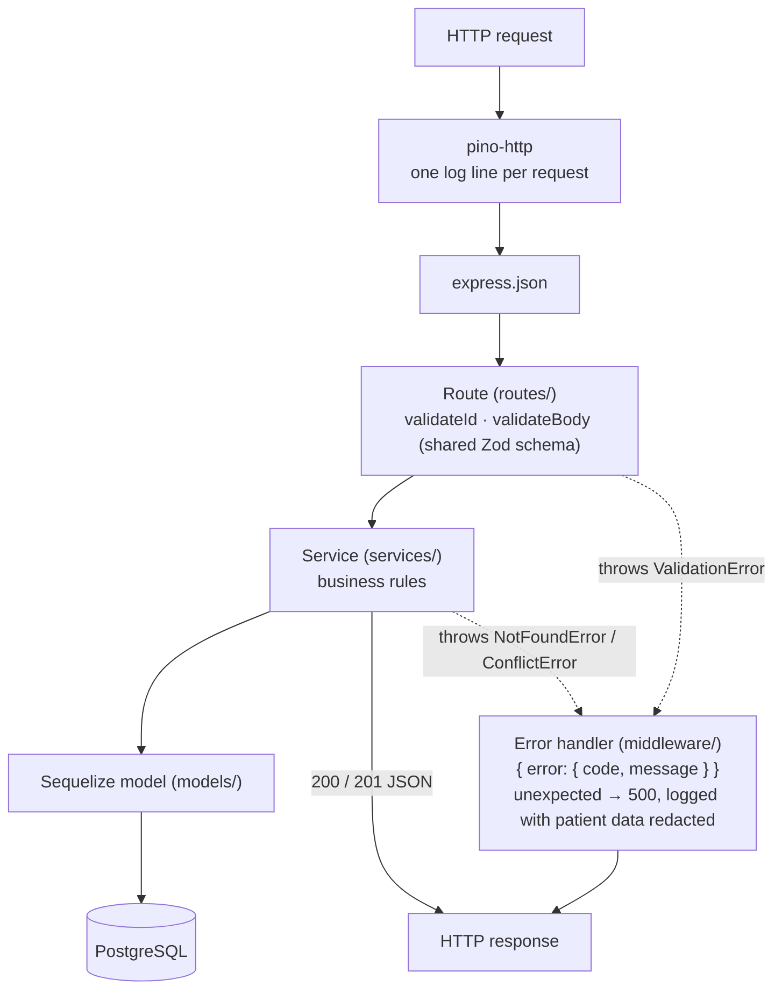
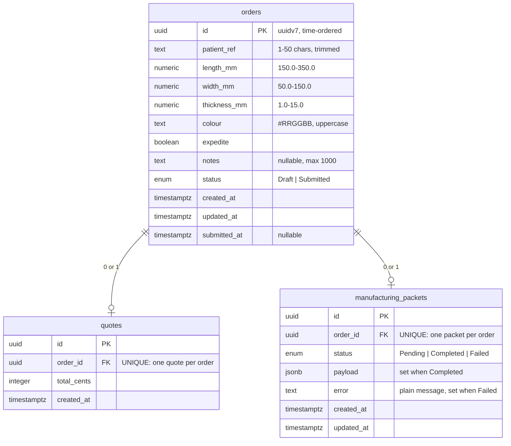
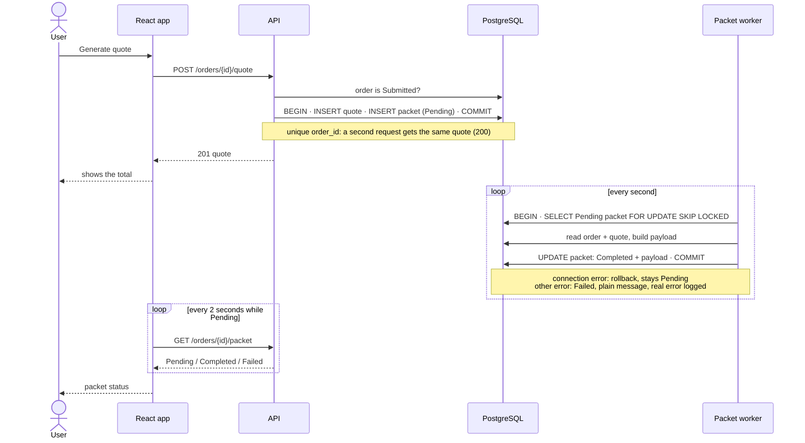
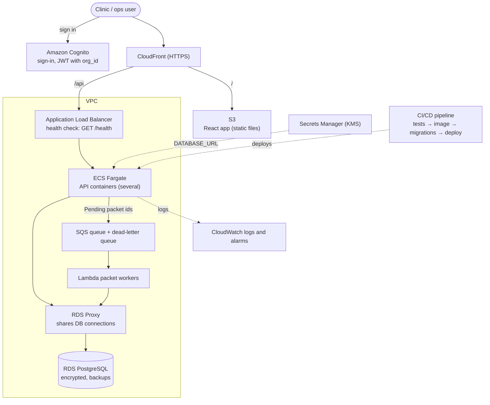

# Architecture

How the system fits together: as built (sections 1–4), and the recommended production setup (section 5, not built). Diagrams are [Mermaid](https://mermaid.js.org/), which GitHub draws from the text.

## 1. System as built

- **One validation schema** in `packages/shared` is used by the form (instant errors) and the API (the real check), so the two cannot disagree.
- **The API is stateless:** everything lives in Postgres, so several instances can run side by side. Their workers share the packets safely with `FOR UPDATE SKIP LOCKED`.
- **Tests** use a second Postgres container (port 5433, in-memory storage), so they never touch dev data.

## 2. Inside the API

| Layer | Folder | Job |
|---|---|---|
| Routes | `apps/api/src/routes/` | HTTP only: read the request, call a service, send the response |
| Middleware | `apps/api/src/middleware/` | Validate ids and bodies; turn every error into one JSON format |
| Services | `apps/api/src/services/` | Business rules: status changes, quotes, packets |
| Models | `apps/api/src/models/` | Tables mapped to TypeScript (Sequelize) |
| Worker | `apps/api/src/workers/` | Builds manufacturing packets in the background |

## 3. Data model

Indexes: `orders (status, id)` for the filtered orders list, newest first; `manufacturing_packets (status, id)` for the worker's search for Pending packets. Details: [spec 01](specs/01-data-model.md).

## 4. Quote and manufacturing packet

Details: [spec 05](specs/05-async-packet.md).

## 5. Recommended production setup (not built)

The system runs locally (decision 3). This is how it would run on AWS; each part links to its recommendation.

| Part | Why | Recommendation |
|---|---|---|
| Cognito + `org_id` in every query | Sign-in, and each clinic sees only its own orders | §6 |
| CloudFront + S3 | The frontend is static files: fast and cheap | §7 |
| ALB + ECS Fargate | Runs several API containers, HTTPS, health checks, graceful shutdown | §7, §10 |
| RDS + RDS Proxy | Managed Postgres with encryption and backups; the proxy keeps total connections under Postgres's limit | §8, §9 |
| SQS + Lambda | Packets start immediately, retries and a dead-letter queue built in, workers scale apart from the API. Added when volume needs it | §3 |
| Secrets Manager | Database credentials never in code or images | §5 |
| CloudWatch | Logs (patient data redacted) and alarms, e.g. on Failed packets | §8 |

Recommendations: [recommendations.md](recommendations.md).
