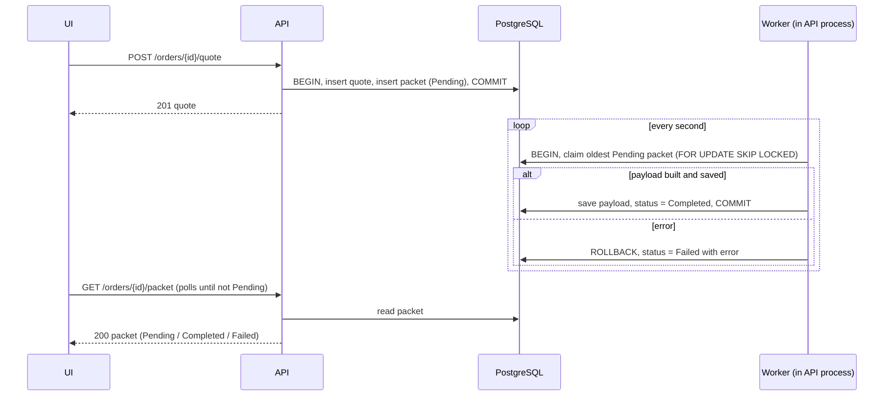

# Async packet

Status: Approved

## Source

When a quote is created for the first time:

- create a ManufacturingPacket with status Pending
- process it asynchronously
- generate a JSON payload containing order and quote details
- persist the payload
- mark the packet Completed or Failed

## Behaviour

The packet is created as `Pending` in the same transaction as the quote (spec 04). The quote request returns straight away; a worker processes the packet in the background.



### Worker

Runs inside the API process and checks for `Pending` packets every second. All logic is in one function, `processNextPacket()`, so tests can call it directly.

`processNextPacket()`, in one transaction:

1. Claim the oldest `Pending` packet:
   ```sql
   SELECT * FROM manufacturing_packets
   WHERE status = 'Pending'
   ORDER BY id
   LIMIT 1
   FOR UPDATE SKIP LOCKED;
   ```
   No packet → do nothing.
2. Read the order and its quote, build the payload.
3. Save the payload, set status `Completed`.

If step 2 or 3 throws: roll back, set status `Failed` with the error message, and log it with pino.

- `FOR UPDATE` locks the claimed row; `SKIP LOCKED` makes other workers skip it, so a packet is never processed twice, even with several workers.
- If the API stops mid-processing, the transaction is rolled back and the packet is still `Pending`, so it is processed after restart.

### Why no retries

- **Temporary problems are already retried.** If the database is unavailable or the API stops mid-processing, the transaction rolls back and the packet stays `Pending`, so the next poll tries again.
- **Only permanent errors become `Failed`.** An error in our code or data fails the same way every time; it needs a fix, not a retry.
- Retries matter when calling an external system that can fail temporarily. That is part of recommendation 3 (queue with built-in retries).

### Payload

```json
{
  "orderId": "01a104ee-ceb5-7595-8401-5c400669e650",
  "patientRef": "PT-1042",
  "lengthMm": 260,
  "widthMm": 90.5,
  "thicknessMm": 3.5,
  "colour": "#3366FF",
  "expedite": true,
  "notes": null,
  "submittedAt": "2026-10-04T09:21:40.117Z",
  "quote": {
    "id": "01a104ee-ceb5-75b3-8b1d-c142a132fb2c",
    "totalCents": 17509
  },
  "generatedAt": "2026-10-04T09:22:07.350Z"
}
```

## Edge cases

| Situation | Expected | Test |
|---|---|---|
| A `Pending` packet exists | `Completed`, payload saved, `error` null | `completes a pending packet` |
| Payload content | Matches the order and quote | `builds the payload from the order and quote` |
| No `Pending` packets | Nothing changes | `does nothing when no packet is pending` |
| Processing throws (simulated) | `Failed`, error message saved, payload null, logged | `marks the packet failed on error` |
| Two workers run at the same time, one `Pending` packet | Processed once | `processes a packet only once with two workers` |
| `Completed` or `Failed` packet | Not processed again | `does not reprocess finished packets` |

## Acceptance criteria

1. A packet created by the first quote ends up `Completed` with the payload above, or `Failed` with an error.
2. Every edge case above has a passing integration test.

## Out of scope

- Retrying failed packets: see "Why no retries" above.
- A separate worker process or message queue: the brief asks for a simple asynchronous process; a queue is recommendation 3 in [recommendations.md](../recommendations.md).
