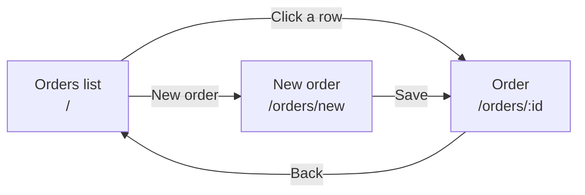

# Frontend

Status: Approved

## Source

- React (Vite), TypeScript, a UI library of choice
- Order creation and editing form with validation
- Disable editing when order is Submitted
- Submit order workflow button
- Generate quote and display result
- Display manufacturing packet status
- Consider the operations manager using it for high-volume order processing

## Behaviour

App in `apps/web`: Vite, React, TypeScript, Mantine (UI and forms), TanStack Query (API calls), React Router (pages).

### Pages

**Orders list (`/`)**

- Table: patient ref, status, dimensions, quote total, created date. Newest first.
- Status filter: All / Draft / Submitted.
- "Load more" button while there is a next page.
- "New order" button. Clicking a row opens the order.

**New order (`/orders/new`)**

- Order form and 3D preview (spec 07) side by side; the preview follows the form values.
- Save → creates the order → opens its page.

**Order (`/orders/:id`)**

- Heading: patient ref and status badge. The long `id` is not shown.
- Same form and 3D preview.
- **Draft:** form editable; "Save" and "Submit" buttons. Submit asks for confirmation first.
- **Submitted:** all fields disabled except Notes, which has its own "Save notes" button. "Generate quote" button until a quote exists.
- **Quote:** shows the total, e.g. `175.09`.
- **Packet:** status badge (Pending / Completed / Failed). While Pending, the page checks every 2 seconds and stops once it is Completed or Failed. Failed shows the error message.

### Form

- Validated with the same Zod schema as the API (`packages/shared`), so the rules cannot differ.
- Errors show under each field.
- Dimensions use number inputs with the allowed range and 0.1 steps.
- Colour uses a colour picker.

### Requests

- Buttons are disabled while their request runs, so a double click does not send twice.
- API errors show as a notification with the API's message.
- After a 409 (e.g. the order was submitted in another tab), the order is reloaded so the page shows the current state.

### API calls in development

The frontend calls `/api/...`. Vite's dev server forwards these to the API (removing `/api`), so no CORS setup is needed. The `/api` prefix keeps API paths separate from page paths like `/orders/:id`.

### Tests

Jest with React Testing Library in a browser-like environment (jsdom). The API is mocked.

## Edge cases

| Situation | Expected | Test |
|---|---|---|
| Invalid value (e.g. width 200) | Error under the field, nothing sent | `shows a validation error` |
| Valid new order saved | Create request sent, order page opens | `creates an order` |
| Submitted order | Fields disabled except Notes | `disables editing when submitted` |
| Submit clicked | Confirmation, then status shows Submitted | `submits an order` |
| Generate quote clicked | Total shown | `shows the quote total` |
| Packet Pending, then Completed | Badge updates, checking stops | `polls packet status until finished` |
| Packet Failed | Error message shown | `shows a failed packet` |
| Request in progress | Button disabled | `disables a button while saving` |
| API returns an error | Notification with the message | `shows API errors` |

## Acceptance criteria

1. The three pages behave as described.
2. Every edge case above has a passing test.

## Out of scope

- Login and users: not in the brief.
- Searching orders: not in the API (spec 04).
- Showing the packet payload: the brief asks for the packet status only.
- Mobile layout: an operations tool used on desktop; it should still not break on small screens.
